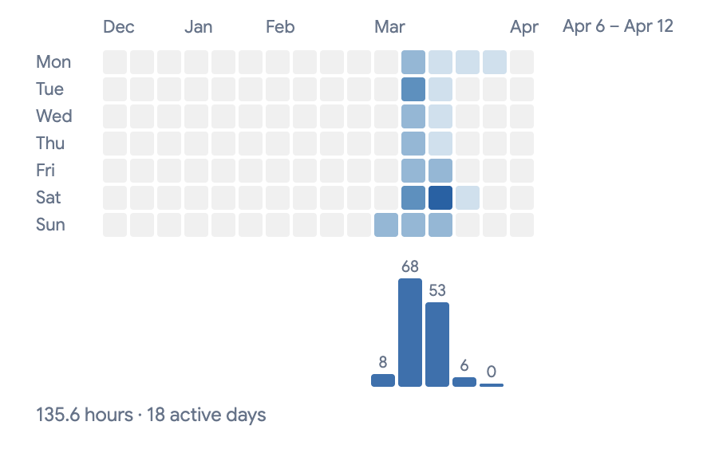

Every Claude Code session starts fresh. That's mostly fine. But somewhere around my hundredth session, I started noticing a pattern: I'd worked through something two weeks ago — a design decision, a debugging path, something I'd finally figured out — and now I needed it again. The session was gone, cleared from disk. Claude Code keeps sessions for 30 days.

I checked once. I had over a thousand JSONL session files on my machine. The qrec project alone had nearly 400 sessions sitting there. They were all technically readable — you could point Claude at them — but each file is raw JSONL packed with tool calls, thinking blocks, and execution noise. Months of decisions and debugging, accessible only if you were willing to spend the tokens and time to trawl through them every single time.

That's when I started building qrec.

## The tools I tried first

Two tools already exist for this. qmd indexes your Claude sessions and serves a search API. claude-mem hooks into your sessions and lets Claude query its own history. I tried both and didn't stick with either.

With qmd, the CLI felt slow because it loaded models on every query. I wanted to skip the markdown conversion step (Claude Code stores sessions as JSONL already, so converting felt like an unnecessary hop), and I wanted a web UI, and I wanted to experiment with the retrieval pipeline. At some point there were enough things I wanted to change that building felt more practical than forking. I'll note I was partly wrong: I found out later that `qmd serve` runs a background server, which would've helped with the speed. But the other reasons still stood.

With claude-mem, I installed it via two plugin commands and genuinely couldn't tell what was happening. Something was downloading model weights and indexing my history in the background, but the process was invisible. When a tool is running on your private session history, you should be able to watch it happen. That became the thing I was most determined to do differently.

## The bets I made

I started with a clear constraint: nothing leaves your machine. Summaries and tags are generated on-device by a local model (Qwen3-1.7B) — I evaluated smaller sizes first, the 0.5B hallucinated too much, the 1.5B was accurate enough — with no API calls and no tokens spent. Search runs against SQLite using BM25 lexical matching and vector KNN fused together, returning results around 50ms per query, with a persistent daemon keeping the embedding model loaded between searches.

When you first install qrec, the dashboard shows you the embedding model downloading (progress bar, kilobytes ticking up), then your sessions being indexed (42 of 225, 19%), then "Run your first search." The activity feed — enrichment runs, index scans, model loads — stays visible as long as the daemon is running. This came directly from how opaque claude-mem had felt: when a tool is running on your private session history, you should be able to watch every step rather than just assume it's doing the right thing.

## The thing I didn't design for

At some point I was in a long Claude Code session about to hit the context limit. The usual path is to wait for compaction — slow, burns tokens. Instead I opened a new session, typed "pick up context from the previous session," and pointed Claude at qrec. It came back with the exact decision we'd been circling around — which database schema to use for the session index — and we continued from there without re-explaining anything.

qrec strips tool results and thinking blocks from session transcripts, keeping a clean user-assistant exchange with one-liner tool summaries where the tool calls were. A 200-turn session becomes a readable thread.

I'd been thinking of qrec as a recall engine: you search for something you forgot. This was different. I wasn't searching. I was handing off state to the next session. It's not "search your past sessions" — it's "carry context across session boundaries without burning tokens."

While writing this post, I was doing the handoff thing constantly. Five sessions from March 21st in the qrec index start with "pick up context from the latest session" and a recall skill call. I used qrec to write the introduction to qrec.

## Where things stand

This project took 135.6 hours across 18 active days, with peak weeks of 68 and 53 hours in March. Most of it went into things I hadn't planned for — the eval framework took weeks to reach a state I'm still not happy with, and the demo video ate an entire weekend in Remotion: 8 scenes, ElevenLabs voiceover, Clawd mascot pixel art drawn from scratch, while I used qrec between sessions just to keep track of where I'd left off.

## The eval problem

The setup seemed reasonable: sample sessions, have Claude Haiku generate queries from each one, then check whether the source session appears in the top 10 results (Recall@10). Scores look healthy.

The problem is contamination. Haiku generates queries by reading the session content, so it naturally uses the same vocabulary the session uses. Real users don't write queries that match how sessions are written. When I searched "heatmap grid over extend," the most relevant session ranked 8th. That session used "overflows," "expansion," "overflows the grid width" — not "over extend." BM25 had zero token overlap and semantic search didn't bridge the gap; all ten results scored between 0.0138 and 0.0164, essentially noise. The eval said things were fine. The search wasn't.

There's also a freshness problem: labels go stale. "Session A is correct for query Q" was true at 300 sessions. At 486, a newer session might be more relevant, and the eval now penalizes the system for surfacing the better answer.

The right setup is to freeze a snapshot for regression testing and use LLM-as-judge on the live index for real quality measurement. That's what comes next — once the signal is trustworthy, better ranking: query expansion to bridge vocabulary gaps, maybe a lightweight reranker once there's enough usage data. The search quality problem isn't solved, and fixing the eval that's been hiding that fact matters more right now than fixing the search itself.
